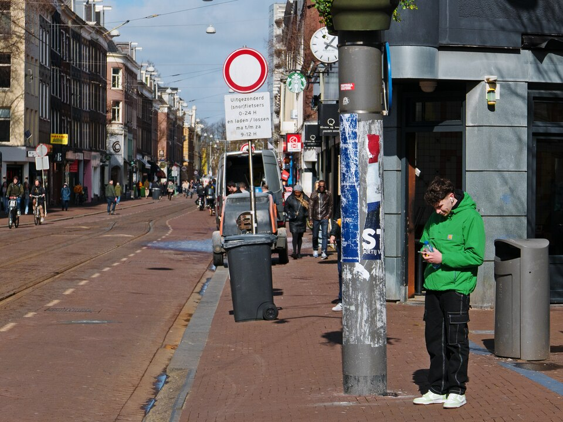

Here is an example of a candid street photograph:

***

### **Required Reading on Ethics & Approach:**

Due to technical issues with the original PDF source file, please review this alternative guide on the philosophy and ethics of documentary practice from a reputable source:

> **[Click Here to Read: The Post-Documentary Photographers Who Care About the World (Aperture Foundation)](https://aperture.org/editorial/the-post-documentary-photographers-who-care-about-the-world/)**
