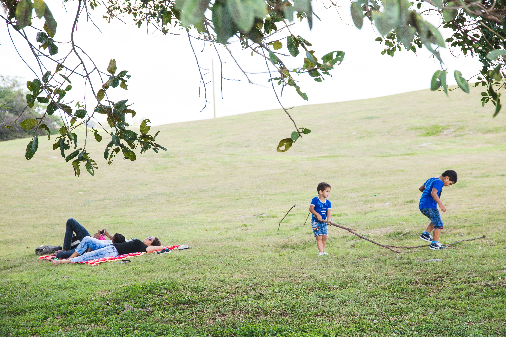

# Essential Gear

While artistic skill is infinitely more important than the brand of your camera, having the right tools makes a genuine difference in your efficiency and comfort.

## Must-Have Equipment
* A prime lens (35mm or 50mm) for a natural, human-eye field of view.
* A sturdy, comfortable camera strap for long, multi-hour walks.
* Extra batteries, especially if you are shooting in cold urban weather.
* A discrete camera bag that does not look like professional photography gear.

Choosing the right lens is a frequent debate. Some prefer the wider angle of a 35mm to include more architectural context, while others prefer the 50mm for subject isolation. Once you have settled on your equipment, you should look into the [[camera-basics]] to ensure you are using that gear to its full potential. Also, consider how your gear choice—such as a silent shutter—affects your ability to adapt to varying [[lighting-conditions]] without drawing unwanted attention to yourself. Investing in gear that makes you feel confident is the best way to ensure you actually carry your camera everywhere.